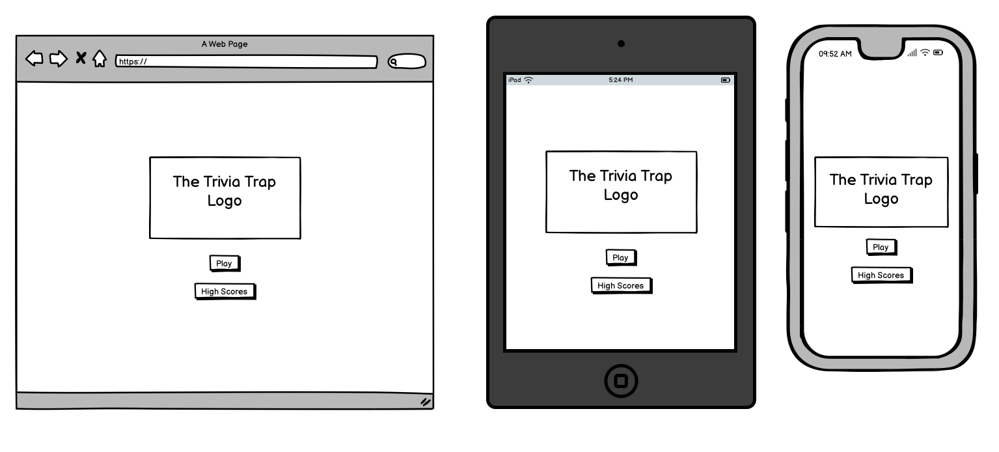
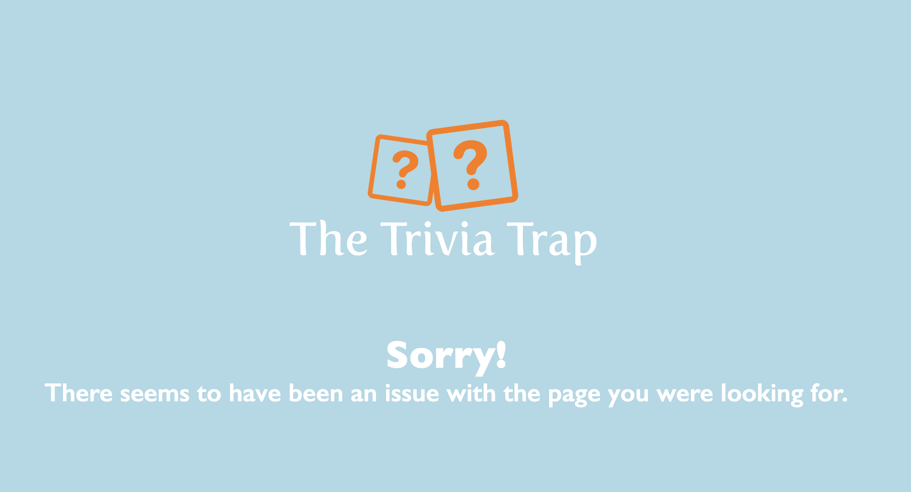

# The Trivia Trap

The deployed site can be visited here: [The Trivia Trap](https://maarkwilliams.github.io/Project2/)

Quizzes are a fun and engaging way to challenge yourself and learn new facts. With trivia games growing in popularity, online quizzes have become a go-to activity for people of all ages. Whether you're a casual player or a trivia expert, this quiz app will put your knowledge to the test with a variety of questions across different categories.

Are you ready to see how much you know? Jump in and start quizzing!

## CONTENTS

* [User Experience](#user-experience-ux)
  * [User Stories](#user-stories)

* [Design](#design)
  * [Colour Scheme](#colour-scheme)
  * [Typography](#typography)
  * [Imagery](#imagery)
  * [Wireframes](#wireframes)
  * [Features](#features)
    * [The Home Page](#the-home-page)
    * [The Game Page](#the-game-page)
    * [The End Page](#the-end-page)
    * [The High Scores Page](#the-high-score-page)
    * [The 404 Error Page](#the-404-error-page)
    * [Future Implementations](#future-implementations)
  * [Accessibility](#accessibility)

* [Technologies Used](#technologies-used)
  * [Languages Used](#languages-used)
  * [Frameworks, Libraries & Programs Used](#frameworks-libraries--programs-used)

* [Deployment & Local Development](#deployment--local-development)
  * [Deployment](#deployment)
  * [Local Development](#local-development)
    * [How to Fork](#how-to-fork)
    * [How to Clone](#how-to-clone)

* [Testing](#testing)
  * [Solved Bugs](#solved-bugs)
  * [Known Bugs](#known-bugs)
  
* [Credits](#credits)
  * [Code Used](#code-used)
  * [Content](#content)
  * [Media](#media)
  * [Acknowledgments](#acknowledgments)

  - - -
  

## User Experience (UX)

### User Stories

#### First Time Visitor Goals
* I want to easily understand what the quiz is about and how to play.
* I want the quiz to be visually appealing and work smoothly on my device.
* I want to start a quiz quickly without needing to sign up.

#### Returning Visitor Goals
* I want to try new quizzes or different categories of questions.
* I want to track my previous scores and see my progress.

---

## Design

### Colour Scheme

I chose a simple color scheme for my website to keep it clean and inviting. The background is light blue, with a mix of black and white text for contrast. Dark blue buttons were added to stand out effectively. This approach ensures the site remains visually appealing without feeling overwhelming while maintaining a friendly and welcoming feel.

* I have used #ADD8E6 for my background. 
* I have used #FFFFFF and #000000 for text and some text backgrounds.
* I have used #007bff for the buttons and some text.
* I have used #ff0000 and #008000 for the correct and incorrect answers.

### Typography

* I used the font 'Gill Sans' throughout the whole website. It is a fun and friendly font that is also easy to read. Its clean, humanist letterforms enhance legibility, making it suitable for both body text and headings. The balanced design strikes a perfect mix between geometric precision and organic shapes, giving the website a professional yet approachable feel. Gill Sans is also highly versatile, ensuring a consistent and polished look across different sections of the site. 

* I chose Fertigo Pro for my logo because of its elegant and unique design, which conveys both professionalism and creativity. The font’s smooth curves and distinctive character make it memorable, while its excellent readability ensures clarity. Fertigo Pro’s balanced and polished appearance perfectly reflects the qualities I want my brand to embody.

### Imagery

I used [NameCheap Logo Maker](https://www.namecheap.com/logo-maker/) in order to create my logo.

### Wireframes

Wireframes were created for mobile, tablet and desktop using balsamiq.

### Features

The website is made up of a home page, a game page, an end page, a highscore page and a 404 error page.

All page are responsive and have the below:

* A favicon in the browser tab.

* The logo of the website on everypage. This also acts as a way to navigate back to the home page.

#### The Home Page

The Trivia Trap's homepage has a welcoming design with a simple, user-friendly interface, making it inviting to participate in the quiz. It features two buttons: one to start the quiz and another to view the high scores.

#### The Game Page

The game page prominently displays the site's name as a title, which also serves as a link back to the homepage. The quiz area includes the question, four answer buttons, the question's topic, and the user's score. Players will answer 10 randomised questions. Once a user selects an answer, they cannot choose another until the next question appears. Correct answers are highlighted in green, while incorrect selections turn red, with the correct answer displayed in green. If the user answers correctly, their score increases by one before the next question loads.

#### The End Page

After completing the quiz, the user is directed to the end page, which confirms the quiz has finished and displays their final score. They have the option to enter their username and submit it to the high scores. Additionally, there are two buttons allowing them to either play again or return to the homepage.

#### The High Score Page

The user can access this page by either clicking the button on the homepage or after submitting their username once the quiz is completed. This page will display the top 5 highest scores, showcasing those with the best results.

#### The 404 Error Page

The 404 error page displays text informing the user that there has been an error. Even though the user is unable to navigate to the page they want, the custom error page will improve their overall experience.

. ?????

#### Future Implementations

In the future, I would like to implement: 

1. A leaderboard system to allow users to compare scores with friends and other players.
2. A user login feature to track progress and earn achievements.
3. More quiz categories and difficulty levels to keep the experience fresh and engaging.
4. A multiplayer mode where users can compete in real-time quizzes.
5. Improved accessibility features, such as a dark mode and text-to-speech for questions.

### Accessibility

I have made a conscious effort during the development process to ensure the quiz app is highly accessible. I have achieved this by:

* Using semantic HTML to enhance readability and improve screen reader support.
* Implementing clear hover and focus states on interactive elements to improve navigation.
* Choosing readable fonts and ensuring adequate text contrast for better visibility.
* Ensuring color choices are accessible, avoiding combinations that may be difficult for users with color blindness.

- - -

## Technologies Used

### Languages Used

Html, CSS & JavaScript

### Frameworks, Libraries & Programs Used

* [Balsamiq](https://balsamiq.com/) - To create wireframes.

* [Git](https://git-scm.com/) - For version control.

* [Github](https://github.com/) - To save and store the files for the website.

* [GitPod](https://gitpod.io/) - IDE used to create the site.

* [Google Fonts](https://fonts.google.com/) - To import the fonts used on the website.

* [Google Developer Tools](https://developers.google.com/web/tools) - To troubleshoot and test features, solve issues with responsiveness and styling.

* [Favicon.io](https://favicon.io/) To create favicons.

* [Am I Responsive?](http://ami.responsivedesign.is/) To show the website image on a range of devices.

- - -

## Deployment & Local Development

### Deployment

The site is deployed using GitHub Pages - [Hive Fitness](link here).

To Deploy the site using GitHub Pages:

1. Login (or signup) to Github.
2. Go to the repository for this project, [maarkwilliams/Project2](https://maarkwilliams.github.io/Project2/).
3. Click the settings button.
4. Select pages in the left hand navigation menu.
5. From the source dropdown select main branch and press save.
6. The site has now been deployed, please note that this process may take a few minutes before the site goes live.

### Local Development

#### How to Fork

To fork the repository:

1. Log in (or sign up) to Github.
2. Go to the repository for this project, [maarkwilliams/Project2](https://maarkwilliams.github.io/Project2/).
3. Click the Fork button in the top right corner.

#### How to Clone

To clone the repository:

1. Log in (or sign up) to GitHub.
2. Go to the repository for this project, [maarkwilliams/Project2](https://maarkwilliams.github.io/Project2/).
3. Click on the code button, select whether you would like to clone with HTTPS, SSH or GitHub CLI and copy the link shown.
4. Open the terminal in your code editor and change the current working directory to the location you want to use for the cloned directory.
5. Type 'git clone' into the terminal and then paste the link you copied in step 3. Press enter.

- - -

## Testing

Please refer to [testing.md](testing.md) file for all testing carried out.

### Solved Bugs

| No | Bug | How I solved the issue |
| :--- | :--- | :--- |
| 1 | Quiz questions were not displaying in the correct order | Adjusted the JavaScript logic to ensure questions were loaded sequentially. |
| 2 | The "Next Question" button was not working after answering a question | Debugged the event listener and ensured the function was correctly updating the question index. |
| 3 | The score was not updating correctly at the end of the quiz | Fixed a variable scope issue that was preventing the correct score calculation. |
| 4 | High scores were not saving after the quiz ended | Implemented localStorage to store and retrieve high scores even after refreshing the page. |

### Known Bugs

No known bugs remain on the site.

- - -

## Credits

### Code Used

I used???

### Content

All content for the site was written by [Menimeter](https://www.mentimeter.com/blog/meetings/quiz-questions) and myself. 

### Media

I used [NameCheap Logo Maker](https://www.namecheap.com/logo-maker/) in order to create my logo.

### Acknowledgments

I would like to acknowledge the following people:

* Jubril Akolade - My Code Institute Mentor.

* Marko Tot - My Code Institute Tutor.

* Josh Williams - For helping debug and testing the site. 

* Chris Williams - For helping me test the site.

* The Code Institute Slack channel Peer Code Review.