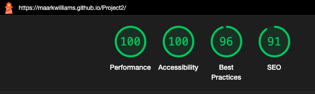
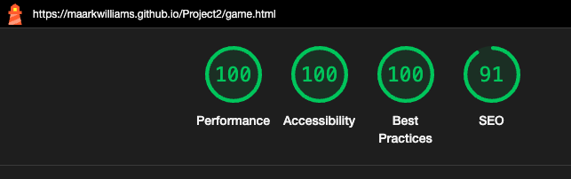
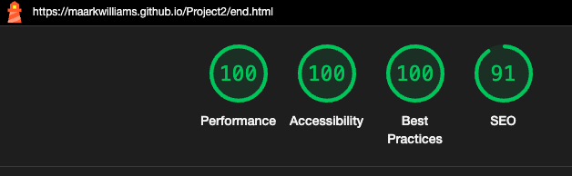
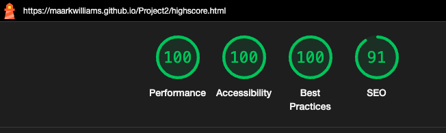
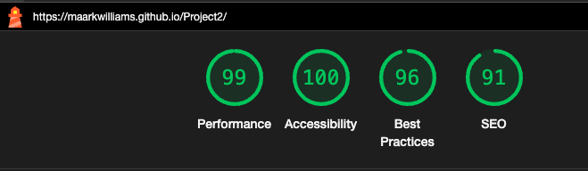
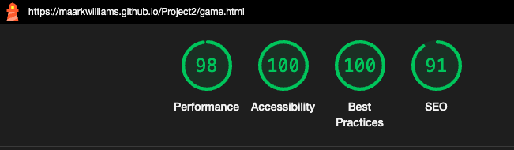
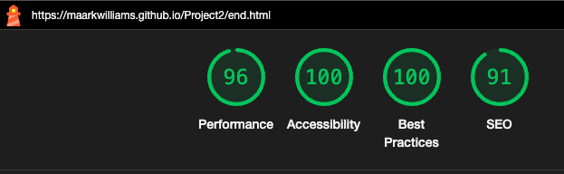
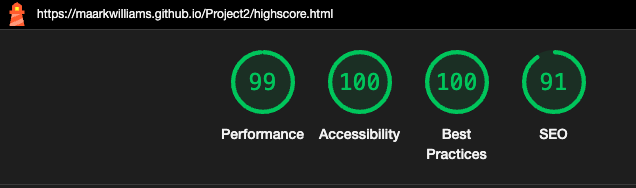

# The Trivia Trap - Testing

Visit the deployed site here: [The Trivia Trap](https://maarkwilliams.github.io/Project2/)

- - -

## CONTENTS

* [AUTOMATED TESTING](#automated-testing)
  * [W3C Validator](#w3c-validator)
  * [Lighthouse](#lighthouse)
* [MANUAL TESTING](#manual-testing)
  * [Testing User Stories](#testing-user-stories)
  * [Full Testing](#full-testing)

Testing was conducted continuously throughout the entire build. I used Chrome Developer Tools to identify and resolve any issues as they arose.

During development, I relied on Google Developer Tools to verify that everything was functioning properly and to help troubleshoot when something wasn't working as expected.

I utilised the console in Developer Tools to test small sections of JavaScript, ensuring the code was executing correctly and pinpointing any issues.

To ensure responsiveness across various screen sizes and devices, I tested each page using both Google Chrome Developer Tools and the Firefox Inspector Tool.

## AUTOMATED TESTING

### W3C Validator

[W3C](https://validator.w3.org/) was used to validate the HTML and CSS on all pages of the website.

* [index.html](testing/w3/indextest.png) - Passed.
* [game.html](testing/w3/gametest.png) - Passed.
* [end.html](testing/w3/endtest.png) - No errors, 1 Warning. The warning is for an empty H2 tag. 
* [highscore.html](testing/w3/highscoretest.png) - Passed.
* [404.html](testing/w3/404test.png) - Passed.

* [style.css](testing/w3/styletest.png) - Passed.

- - -

### JavaScript Validator

[jslint](https://jslint.com/) was used to validate the JavaScript.

* [game.js](testing/jshint/jshint-javascript.png) - Passed.
* [end.js](testing/jshint/jshint-game.png) - Passed with one warning. Async functions are only available in ES8. It also stated that there are 4 unused variables, however these are being used.
* [highscore.js](testing/ ????

### Lighthouse

I used Lighthouse in Chrome Developer Tools to evaluate the website's performance, accessibility, best practices, and SEO.

### Desktop Results

![404.html](testing/lighthouse/

### Mobile Results

![404.html](testing/lighthouse/

- - -

`First Time Visitors`
|  Goals | How are they achieved? |
| :--- | :--- |
| I want to easily understand what the quiz is about and how to play | The user interface is clean and intuitive, with the buttons clearly standing out for easy navigation.
| I want the quiz to be visually appealing and work smoothly on my device | I designed the site with responsiveness as a key priority.
| I want to start a quiz quickly without needing to sign up | The quiz is one click away when on the homepage. 

`Returning Visitors`

|  Goals | How are they achieved? |
| :--- | :--- |
| I want to try new quizzes or different categories of questions. | Each quiz features 10 randomised questions selected from a pool covering 5 different topics.
| I want to track my previous scores and see my progress. | The quiz lets users save their score, and the high scores page shows the top 5 results.

- - -

### Full Testing

Full testing was performed on the following devices:

* Desktop:
  * 34 inch ultrawide & 24 inch 4k monitors
* Laptop:
  * Macbook Pro 2023 14 inch screen
* Tablet Devices:
  * iPhone Pro 12.9 inch.
* Mobile Devices:
  * iPhone 14 Pro Max.

Each device tested the site using the following browsers:

* Google Chrome
* Firefox
* Safari

Additional testing was conducted by friends and family across various devices and screen sizes, and they reported no issues during use.

`Home page`

| Feature | Expected Outcome | Testing Performed | Result | Pass/Fail |
| --- | --- | --- | --- | --- |
| The sites logo | Link to the home page | Click logo | Navigated to the home page | Pass |
| The play button | Link to start the quiz (game.html) | Click button | Navigated to start the quiz (game.html) | Pass |
| The high scores button | Link to the high scores page | Click button | Navigated to the high scores page | Pass |

`Game page`

| Feature | Expected Outcome | Testing Performed | Result | Pass/Fail |
| --- | --- | --- | --- | --- |
| The sites logo | Link to the home page | Click logo | Navigated to the home page | Pass |
| The four buttons | Select an answer | Click button | Selected an answer | Pass |
| Correct answer button | Highlight green | Click button | Button highlighted green | Pass |
| Incorrect answer button | Highlight red | Click button | Button highlighted red | Pass |
| Score increase for correct answer | Go increase by one| Select correct answer | Score increased by one | Pass |

`End page`

| Feature | Expected Outcome | Testing Performed | Result | Pass/Fail |
| --- | --- | --- | --- | --- |
| The sites logo | Link to the home page | Click logo | Navigated to the home page | Pass |
| Username input | Text appear when typed | Type text | Text appears in textbox | Pass |
| Username input left empty | Error message | Text left blank | Error message appeared | Pass |
| Save score button | Save score to highscore | Click button | Users score added to highscore | Pass |
| Go home button | Navigate to home page | Click button | User taken to home page | Pass |
| Play again button | Start a new game | Click button | Game restarts | Pass |

`High score page`

| Feature | Expected Outcome | Testing Performed | Result | Pass/Fail |
| --- | --- | --- | --- | --- |
| The sites logo | Link to the home page | Click logo | Navigated to the home page | Pass |
| Home button | Navigate to home page | Click button | User taken to home page | Pass |
| Display highscores | Users highscore displayed | Saved score | Users score appeared with username | Pass |